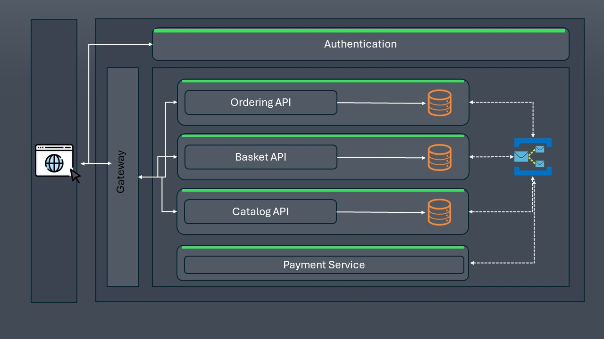

# eShop - Bootcamp .NET CORE + MICROSERVICES

## Get Started

### Tools
    VSCode
    Visual Studio Community
    Docker (Desktop or CE)

## Architecture
    

## Ferramentas / Tecnologias
### Web
- Angular 16 + Material

### Microservices
- SQL Server
- .net core 8.0

### Gateway
- YARP

### Event bus
- Azure
- RabbitMQ

